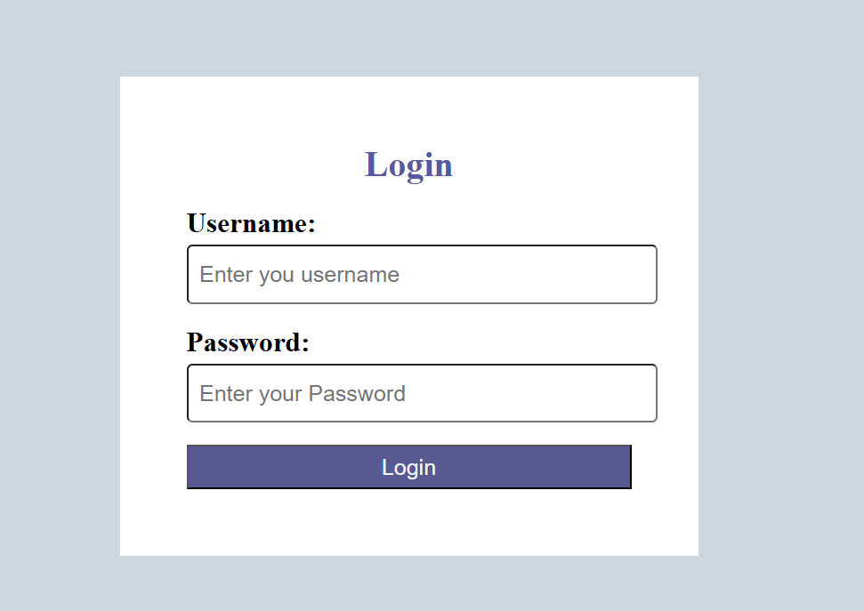
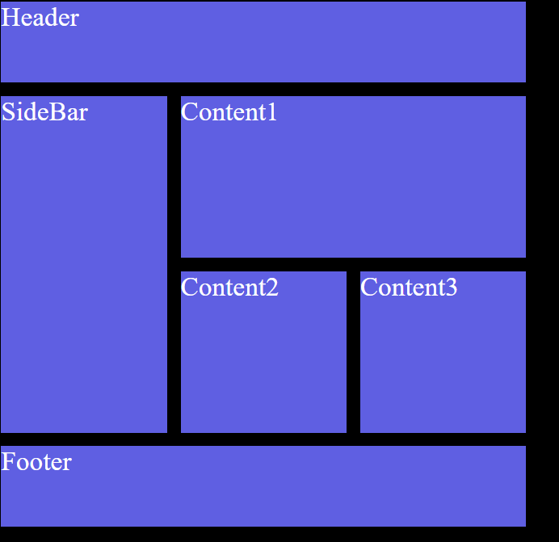

# 🚀 BR-Frontend-Training

This repository is created as part of my **Frontend Training Program**.  
It contains daily tasks focused on building strong frontend fundamentals step by step.

---

## 📅 Day 1 Task: Basics of HTML

### 🎯 Objective
To understand the **fundamentals of HTML** and apply them by creating a small static webpage.

---

## 🧠 Concepts Learned (Day 1)

- Basic structure of an HTML document  
- HTML tags and elements  
- Headings (`<h1>` to `<h6>`)  
- Paragraphs and text formatting  
- Anchor tags (`<a>`)  
- Image tags (``)  
- Lists (Ordered & Unordered)  
- Basic form elements  
- Introduction to semantic HTML  

---

## 🛠️ Practical Implementation

As part of **Day 1 practice**, I created a **simple HTML webpage** using the concepts learned.

### ✨ Features of the Webpage
- Proper HTML boilerplate structure  
- Use of headings and paragraphs  
- Images and hyperlinks  
- Simple and clean layout for practice  

---

## 🖼️ Practice Webpage Preview

Below is the screenshot of the webpage created during ****:

---

## 📘 Studied Topic: HTML Tables (Day 1)

### 🧠 What I Studied
Secondly, I studied **HTML Tables** to understand how tabular data is structured and displayed on a webpage.

### 🔹 Concepts Covered
- `<table>` – Defines the table  
- `<tr>` – Table row  
- `<th>` – Table header cell  
- `<td>` – Table data cell  
- `border`, `rowspan`, `colspan` (basic understanding)  
- Proper alignment of rows and columns  

### 🛠️ Practice
I created a **simple HTML table** to practice:
- Rows and columns  
- Header vs data cells  
- Clean and readable table structure  

### 🖼️ HTML Table Practice Preview
****

---
I studied **HTML Forms** to understand how user input is collected on a webpage.

### 🔹 Concepts Covered
- `<form>` – Form container  
- `<input>` – Text, email, password, number inputs  
- `<label>` – Proper labeling of form fields  
- `<textarea>` – Multi-line text input  
- `<select>` & `<option>` – Dropdown menus  
- `<button>` – Submit button  
- Basic attributes like `type`, `name`, `placeholder`, `required`

### 🛠️ Practice
I created a **simple HTML form** to practice:
- Taking user input  
- Using different input types  
- Structuring a clean and readable form  

### 🖼️ HTML Form Practice Preview
****

---
I also studied **HTML Media Elements** to understand how multimedia content like images, audio, and video can be embedded into a webpage.

### 🔹 Concepts Covered
- `` – Display images on a webpage  
- `<audio>` – Embed audio files with controls  
- `<video>` – Embed video files with controls  
- `src`, `alt`, `controls`, `autoplay`, `loop` attributes  
- Importance of accessibility using `alt` text  

### 🛠️ Practice
I practiced embedding:
- Images using proper paths and alt text  
- Audio files with playback controls  
- Video files with basic controls  

---

## 📅 Day 2 Task: Basics of CSS

I Started Learning **CSS (Cascading Stylesheets)** to understand how to stylize our website. Basically skin of the skeleton created in html

### 🔹 Concepts Covered
-`<inline>`:How to apply css within inline elements
-`<internal>`:How to apply css by using only <style> tag
-`<external>`:Using external css and making the importance of using it.
-`<Units>`:All the units used in css 

---
## 📅 Day 3 Task: CSS Box Model,Positioning of the Elements and Flexbox

Started Learning about box model in which covered the concept of margin,padding,block element and inline-block element.

Secondry Learned about css flexbox model, Specially Parent child property for the alligning of the items

### 🖼️ HTML Form Practice Preview

---

## 📅 Day 3 Task: CSS Box Model,Positioning of the Elements and Flexbox

Studied about CSS Grid and Learned how to Develop modern ui 
### 🖼️ HTML Form Practice Preview

